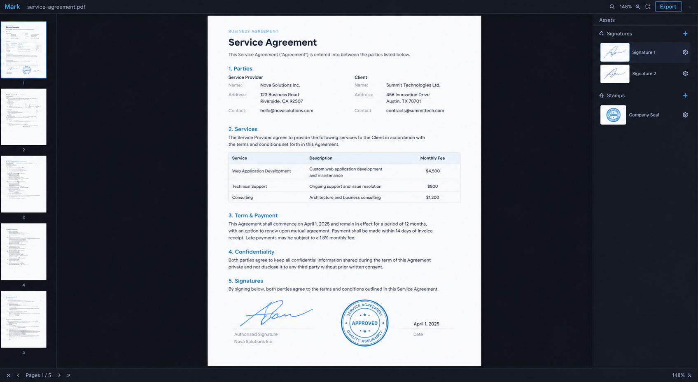

# Mark

**Mark. Sign anything.**



Open a PDF or an image, drop your signature or a stamp onto it, put it
exactly where it belongs, repeat on the next page, export. The original
file is never touched — the signed copy is a new file, written beside it.

Native Rust, no Electron, no network, no account. Built with GPUI, so it
follows your desktop's theme and behaves like the rest of your apps: on
Omarchy it is an Omarchy app, on macOS a Mac app, on Windows a Windows
app.

## Install

Download the artifact for your machine from the
[latest release](https://github.com/javaded/mark/releases), unpack it, and
run it. The PDFium runtime ships inside the package, next to the
executable — no setup step.

**Linux** — unpack `mark-*-linux-x64.tar.gz` and either run `mark/mark`
where it is, or install it:

```bash
install -Dm755 mark/mark ~/.local/bin/mark
install -Dm644 mark/libpdfium.so ~/.local/bin/libpdfium.so
install -Dm644 mark/mark.svg ~/.local/share/icons/hicolor/scalable/apps/mark.svg
install -Dm644 mark/mark.desktop ~/.local/share/applications/mark.desktop
```

The runtime is found by absolute path next to the binary, so
`~/.local/bin` works — no rpath or environment to configure. A Wayland or
X11 session with a GPU Vulkan can drive.

**macOS** — unzip `mark-*-mac-arm64.zip` and drag `Mark.app` into
Applications. The build is not signed or notarized, so Gatekeeper stops
the first launch; right-click the app and choose Open, or clear the
quarantine mark once:

```bash
xattr -dr com.apple.quarantine /Applications/Mark.app
```

**Windows** — unpack `mark-*-win-x64.zip` anywhere and run `mark\mark.exe`.

**From source** — a recent stable Rust (rustup gets you one), plus on
Linux: `clang`, `pkg-config` and the GPUI backend libraries
(`libxkbcommon`, `libxcb1`, Wayland + EGL/GLES, `fontconfig` dev
packages). macOS needs Xcode's command line tools, Windows the MSVC
toolchain. Then:

```bash
script/fetch-pdfium.sh    # once per machine: the dev PDFium runtime
cargo run -p mark-app
```

`mark --check-pdfium` (or `cargo run -p mark-pdf --example check_bind`)
reports whether the runtime loads and from where — the first thing to run
when something is off.

## Use

```bash
mark                # empty workspace: open a file, pick from Recent
mark contract.pdf   # or hand it the document directly
```

Drag a PDF, PNG, JPEG or WebP in through the open dialog, or pass it on
the command line. Images become one-page documents sized at one pixel to
one point; PDFs come in with every page, rotation and crop box honored.

**The library starts empty.** Click **+** in the Signature or Stamp
section and import an image (png, jpg or webp); Mark normalizes it to a
PNG copy of its own and keeps it in its data directory, so the original
scan can be filed away or deleted. Import once, sign forever after.

Click an asset to place it: centered on the current page, about a quarter
of the page wide, aspect true, already selected. Drag it where it
belongs; pull a corner to size it — the aspect stays locked unless you
hold Shift. Everything is one undoable step: move, resize, delete,
duplicate, paste.

**The screen.** Thumbnails down the left edge (the current page is
marked; click any of them to go there). The page in the middle, with
zoom −, percent, + and fit in the header. Your assets down the right
edge. A status bar along the bottom: page n of m, first/prev/next/last,
and what the export is doing. Select an object and a small toolbar
appears over the canvas: smaller, bigger, duplicate, to page…, delete.
Transient news — an export finished, a copy landed on page 7 — arrives as
a toast in the corner and goes away on its own; the export toast offers
*Show in folder*.

**Signatures everywhere.** Ctrl/Cmd-D duplicates in place; copy and paste
walks each paste a little further, the way you expect; *To page…* drops a
copy on any page, clamped onto that page's own size. PageUp/PageDown and
Home/End move through the document. Ctrl/Cmd-Z and Ctrl/Cmd-Shift-Z go
back and forward through all of it.

**Export.** Ctrl/Cmd-S opens a save dialog already pointed at the
document's folder with the name filled in: `contract-signed.pdf`. What
you see is what exports — the placement on screen is the placement in the
file. In a PDF the signature becomes a real image object on the page;
text stays selectable, rotated and cropped pages keep their geometry. An
image document exports as a PNG composed at full resolution. Either way
the original stays byte for byte what it was.

**Unsaved work.** The window title carries a `*` while placements have
not been exported. Close the window, quit, or open another document in
that state and Mark asks one question — Export…, Discard, or Cancel — and
the export path resumes what you were doing when it finishes.

Recent documents are listed in the empty workspace; files that no longer
exist drop out of the list on their own.

## Keys

| key                        | does                                    |
| -------------------------- | --------------------------------------- |
| ctrl/cmd-o                 | open a document                         |
| ctrl/cmd-s                 | export the signed copy                  |
| ctrl/cmd-d                 | duplicate the selected object           |
| ctrl/cmd-c, ctrl/cmd-v     | copy, paste (each paste steps aside)    |
| ctrl/cmd-z                 | undo                                    |
| ctrl/cmd-shift-z, -y       | redo                                    |
| delete, backspace          | remove the selected object              |
| escape                     | cancel the gesture, then the selection  |
| pageup, pagedown           | previous, next page                     |
| home, end                  | first, last page                        |
| = / +, -, 0                | zoom in, out, fit                       |
| ctrl/cmd-q                 | quit (asks if work is unexported)       |

On macOS read ctrl/cmd as ⌘; everywhere else as Ctrl.

## What it refuses to do

- It never writes the original document. Export always produces a new
  `-signed` file; the original is asserted byte-identical after export,
  in the test suite, on every platform.
- It never exports a document that silently lost a signature: if a
  library file is missing, the export fails loudly and writes nothing.
- No network, no telemetry, no account. Logs carry counts and outcomes —
  pages, durations, failures — never document contents or signature
  pixels.
- PDFium runs on one worker thread and every export loads the source
  fresh; the document you have open is only ever read.

## Develop

```bash
cargo fmt --check
cargo clippy --workspace --all-targets -- -D warnings
cargo test --workspace --all-targets
```

`script/fetch-pdfium.sh` first, or the PDF integration tests skip. CI
runs the whole suite on Linux, macOS and Windows with the runtime bound.
UI tests are headless windows driving the real application with
synthetic pointer and keyboard, asserting on the document model.

| path                    | what lives there                                        |
| ----------------------- | ------------------------------------------------------- |
| `crates/mark-core`      | the document model, commands, undo/redo — no UI, no I/O |
| `crates/mark-pdf`       | PDFium binding, worker thread, render and PDF export    |
| `crates/mark-image`     | image decoding into one-page documents                  |
| `crates/mark-export`    | PNG export composition, the asset library, recents      |
| `crates/platform`       | file dialogs, data directories, reveal in file manager  |
| `crates/app`            | the GPUI application and its headless UI tests          |
| `script/`, `resources/` | the PDFium fetch and packaging scripts, fixtures        |

`script/package.sh` builds the release artifacts and verifies the
bundled runtime loads; tagging `v*` publishes them to a release.

## License

MIT
